# **Progressive Domain Adaptation**

Object detection for autonomous driving related tasks works in dependence of amount of data and data quality. Not for all situations (domains) this can be guaranteed and transfer learning methods must be applied. In particular we focus on the object detection task under day-night domain shift.

In this project we implement a domain adaptation technique, Domain Adversarial Neural Network for the Object Detector YOLOv3, using CycleGAN to generate synthetic domain to further reduce the domain gap. We create three modularizations, train them on [Berkeley Deep Drive dataset](https://bdd-data.berkeley.edu/) and compare the test performance between the 3 modularizations.

#### **Code Structure**

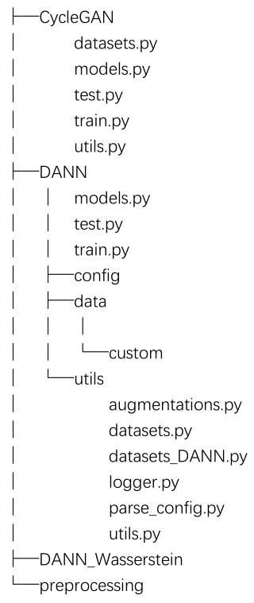

#### **Object Detectors**

This repository has implementations of the object detector in Pytorch:

[YOLOv3](https://arxiv.org/abs/1804.02767)

It uses the Berkeley Deep Drive dataset

#### **CycleGAN**

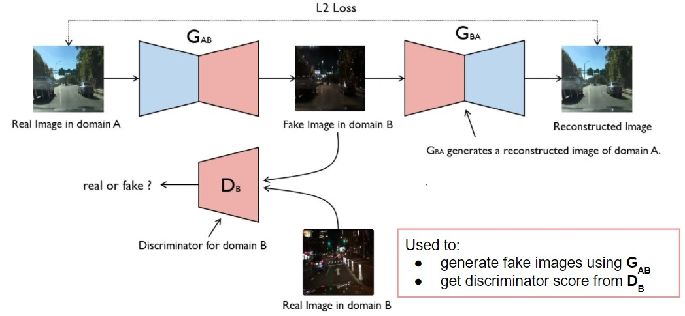

##### **A synthetic domain is generated via CycleGAN**

Original images:

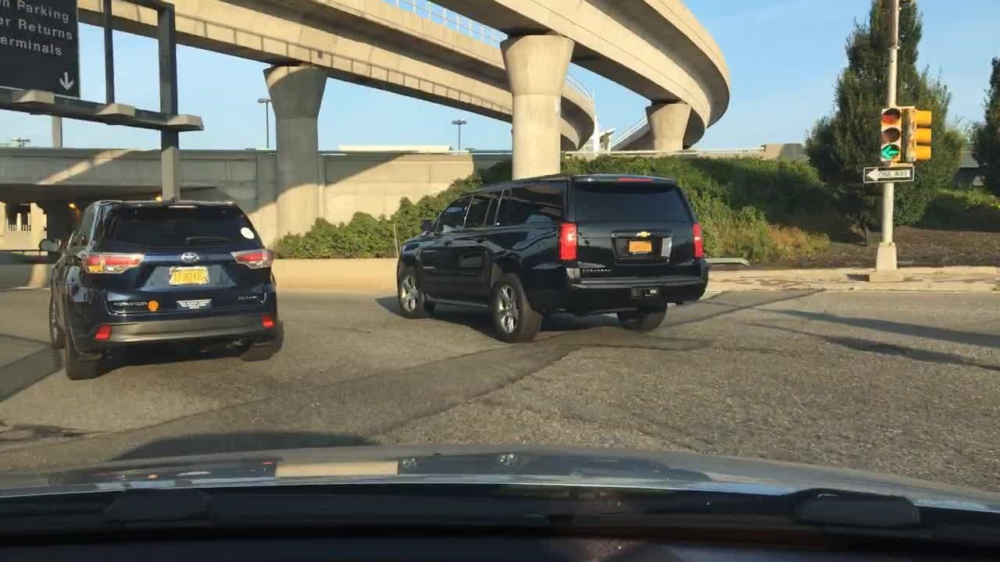

Generated images:

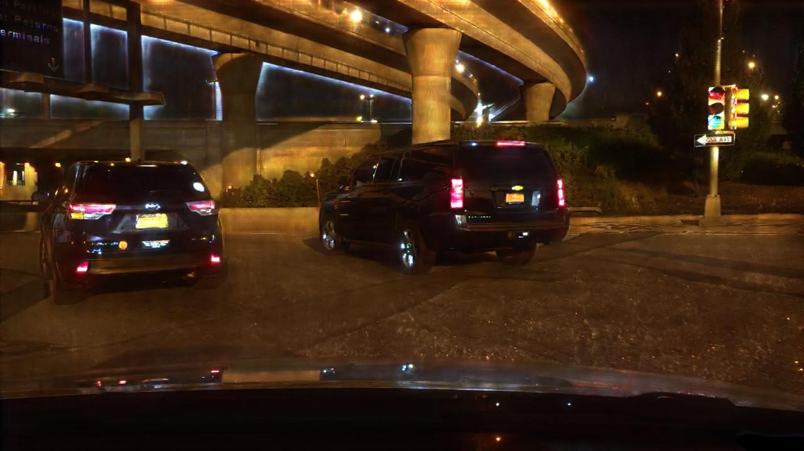

#### **DANN (Domain Adversarial Neural Network)**

DANN has been implemented in 3 modularizations on YOLOv3 and tiny-YOLO.

##### **Framework**

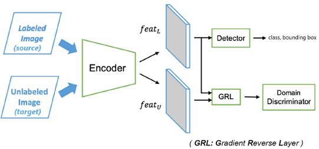

##### **Synthetic domain as an intermediate domain**

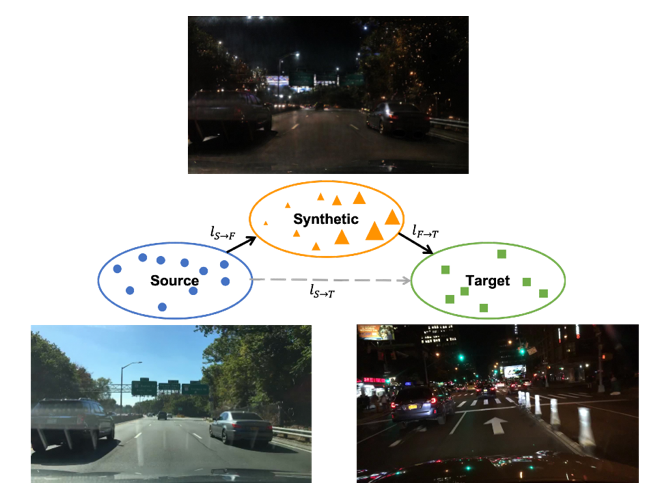

##### **Three modularizations:**

- Modularization 1

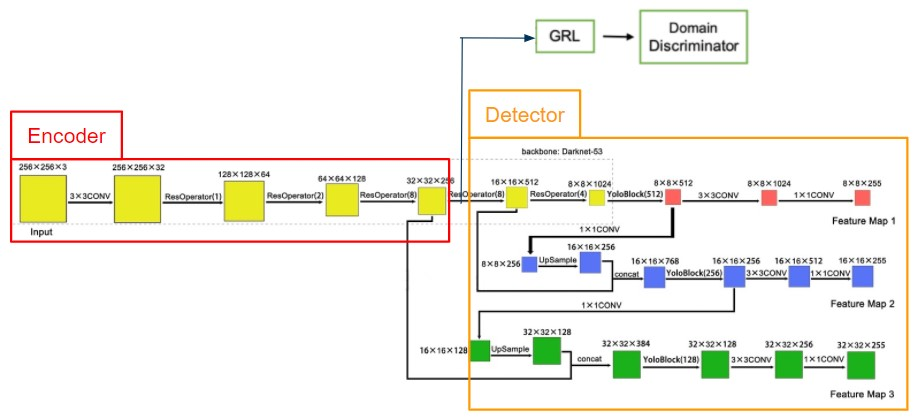

- Modularization 2

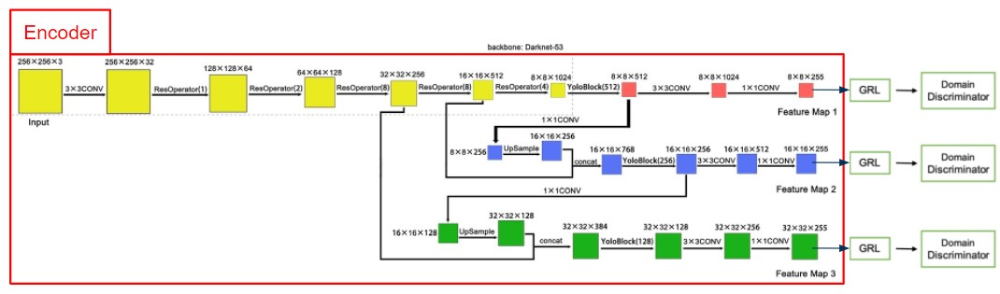

- Modularization 3

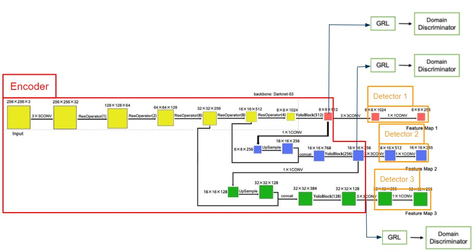

##### **Results of DANN training:**

Detection before DANN

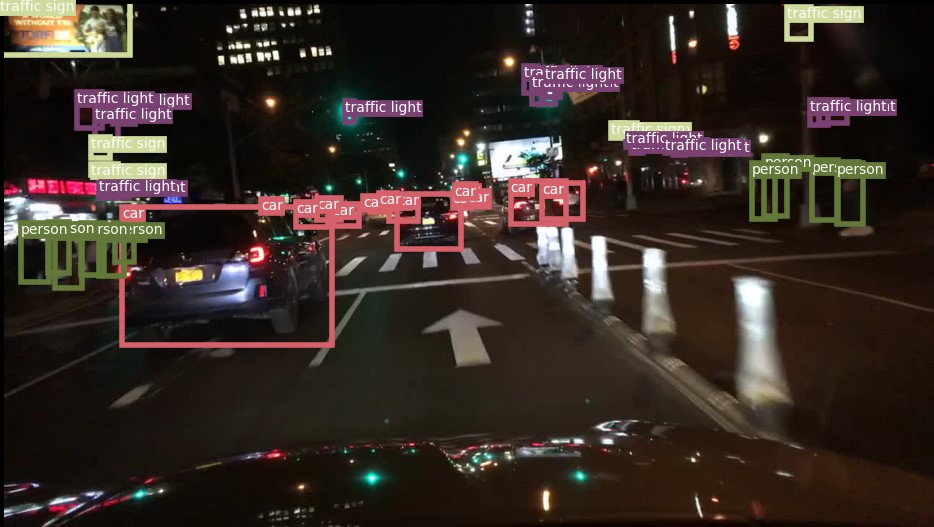

Detection after DANN

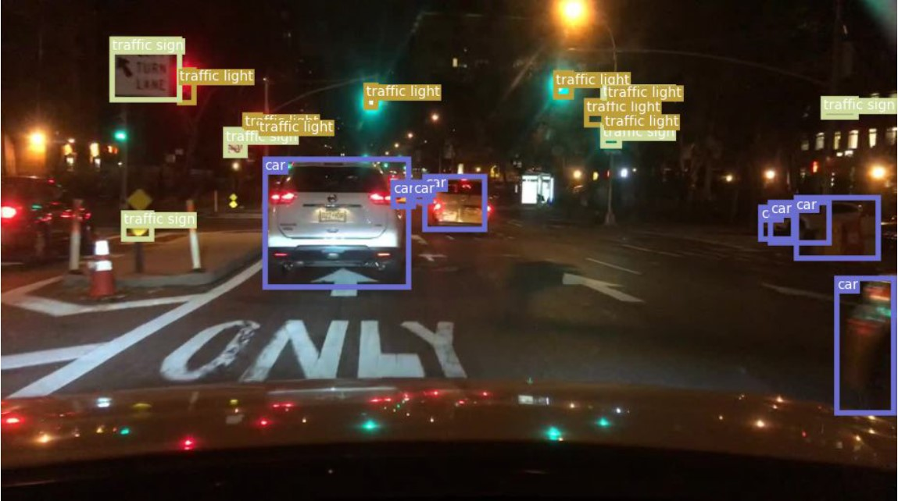

```sh
cd DANN

python train.py --modularization 1 --weighting sigmoid --update_step joint

python test.py --modularization 1 --pretrained_weights checkpoint.pth
```

##### **DANN\_Wasserstein**

We implemented Wasserstein method on modularization 2 to deal with the fluctuation of discriminator loss

```sh
cd DANN_Wasserstein

python train_m2_Wasserstein.py
```

#### **Literature**

BDD100K: A Diverse Driving Video Database with Scalable Annotation Tooling:https://www.arxiv-vanity.com/papers/1805.04687/

Yolov3: An incremental improvement:https://arxiv.org/abs/1804.02767

Unpaired Image-to-Image Translation using Cycle-Consistent Adversarial Networks:https://arxiv.org/abs/1703.10593

Domain-Adversarial Training of Neural Networks:https://arxiv.org/abs/1505.07818

Domain Adaptation for Object Detection via Style Consistency:https://arxiv.org/abs/1911.10033

Progressive Domain Adaptation for Object Detection:https://arxiv.org/abs/1910.11319

Wasserstein Distance Based Domain Adaptation For Object Detection:https://arxiv.org/abs/1909.08675

Improved Training of Wasserstein GANs:https://arxiv.org/abs/1704.00028
